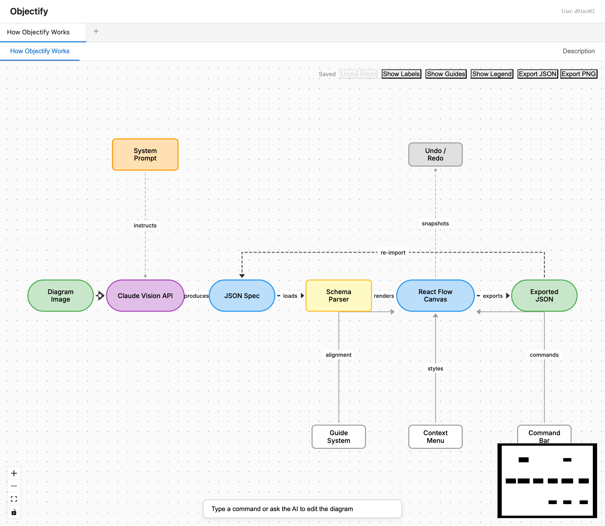

# Objectify

Create, convert, and iterate on diagrams with AI.

Objectify lets you **create diagrams from a text prompt**, **convert existing images** into editable flowcharts, and **chat with your diagram** to refine it iteratively — all powered by AI vision and generation models through [OpenRouter](https://openrouter.ai), so you can use Claude, GPT-4o, Gemini, or any other model with a single API key.



## Features

- **Create from prompt** — Describe a diagram in plain text and let AI generate it
- **Import from image** — Upload a PNG/JPEG and AI extracts nodes, edges, colors, and layout
- **Chat with your diagram** — Ask AI to add nodes, restyle, restructure, or explain what it sees
- **Spatial mode** — Preserves original layout positions and bounding boxes from images
- **Interactive editor** — Pan, zoom, drag, and edit diagrams in the browser
- **Auto-layout** — ELK.js-based automatic layout when spatial data isn't needed
- **Nested groups** — Supports container nodes with children
- **Color palette extraction** — Captures colors from the source image

## Packages

| Package | Description |
|---------|-------------|
| `@objectify/cli` | Command-line tool for extracting diagrams from images |
| `@objectify/schema` | Zod schemas and TypeScript types for diagram specs |
| `@objectify/web` | React-based interactive diagram viewer |

## Quick Start

### Prerequisites

- Node.js 18+
- An [OpenRouter API key](https://openrouter.ai/keys)

### Installation

```bash
npm install
cp .env.example .env
# Edit .env and add your OpenRouter API key
```

### CLI Usage

```bash
# Basic extraction (semantic mode)
npx objectify diagram.png

# Spatial mode (preserves positions from image)
npx objectify diagram.png --spatial

# Custom output directory
npx objectify diagram.png -o ./my-output

# Use a different model (any OpenRouter model ID)
npx objectify diagram.png --model google/gemini-2.5-pro
```

Output is written to `outputs/<image-name>/` by default, containing:
- `diagram-spec.json` — The extracted specification
- A copy of the source image

### Web Viewer

```bash
cd packages/web
npm run dev
```

Open http://localhost:5173, then:
- **Create from Prompt** — describe what you want and AI generates the diagram
- **Import from Image** — upload a diagram image and AI extracts the structure
- **Import JSON** — load a previously exported `diagram-spec.json` file
- Once a diagram is open, use the **command bar** to chat with AI and iterate on it

## Diagram Spec Format

The schema supports both semantic (v1.0) and spatial (v2.0) specifications:

```json
{
  "version": "2.0",
  "description": "Architecture overview showing...",
  "palette": [
    { "id": "blue", "hex": "#2196F3", "percentage": 25 }
  ],
  "diagrams": [
    {
      "id": "main",
      "title": "System Architecture",
      "direction": "RIGHT",
      "layoutMode": "spatial",
      "imageDimensions": { "width": 1200, "height": 800 },
      "nodes": [
        {
          "id": "api-gateway",
          "label": "API Gateway",
          "type": "box",
          "style": { "backgroundColor": "#2196F3", "textColor": "#FFFFFF" },
          "spatial": { "x": 0.1, "y": 0.2, "width": 0.15, "height": 0.1 }
        }
      ],
      "edges": [
        {
          "id": "edge-1",
          "source": "api-gateway",
          "target": "backend",
          "label": "REST"
        }
      ]
    }
  ]
}
```

## Development

```bash
# Install all dependencies
npm install

# Run web viewer in dev mode
npm run dev -w @objectify/web

# Build all packages
npm run build -w @objectify/schema
npm run build -w @objectify/web
```

## Tech Stack

- **CLI**: Commander, OpenRouter API, tsx
- **Schema**: Zod
- **Web**: React 19, React Flow, ELK.js, Vite

## License

MIT
